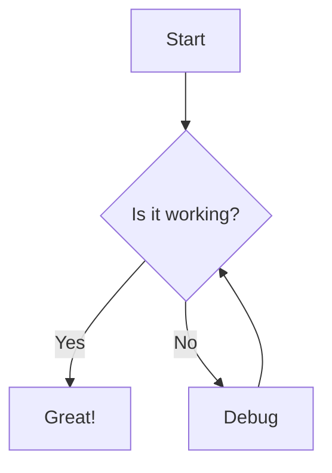

# Getting started with MKDocs

1. Create a python project.
2. Create a venv and activate it. \
    Windows: ``venv\Scripts\activate`` \
    MacOS/Linux: ``venv/bin/activate``

3. Once activated, ``pip install mkdocs``
4. Next create the project with ``mkdocs new .`` which creates a yml file.

You now have your project setup. You can create and edit markdown files 
in the ``/docs`` directory.

### Commands:

``mkdocs serve`` - generate hot reloading docs to access and view \
``mkdocs build`` - generate the files in a directory called ``/site``

To add configuration and navigation, edit the ``mkdocs.yml`` file. The only required
field in this is ``site_name``.

Add nav:

```yaml
site_name: Test Docs
nav:
  - Home: index.md
  - About: about.md
```

### Deploy:

If you're connected to GitHub, you can build and deploy into a separate branch
with one command ``mkdocs gh-deploy``


### Other Items

#### Generate a PDF with:

UNTESTED

Install the Plugin: ``pip install mkdocs-pdf-export-plugin``

Modify mkdocs.yml: Add the plugin to your MkDocs configuration file:

```yaml
plugins:
  - pdf-export
```

If you're using other plugins, ensure you list them as well.

Build the PDF: Run the following command to build the documentation and export the PDF:

``mkdocs build``

The PDF will be generated and placed in the site/pdf/ directory.

#### Use Mermaid Charts

###### Version 1:

``pip install mkdocs-mermaid2-plugin``

Update config:

```yaml
plugins:
  - search
  - mermaid2
```

Write your mermaid markdown

```markdown
# Mermaid Example



Version 1 is limits you to a certain version of Mermaid. This means you can't use the 
new shapes introduced in version 11.3.0+
[https://mermaid.js.org/syntax/flowchart.html#expanded-node-shapes-in-mermaid-flowcharts-v11-3-0](https://mermaid.js.org/syntax/flowchart.html#expanded-node-shapes-in-mermaid-flowcharts-v11-3-0)

##### Version 2:

Update config:

```yaml
extra_javascript:
  - https://cdn.jsdelivr.net/npm/mermaid/dist/mermaid.min.js
```

Add the import into index.md

```markdown
<script>
  mermaid.initialize({ startOnLoad: true });
</script>
```

Write your mermaid

```html
<div class="mermaid">
graph TD
    A[Start] --> B{Is it working?}
    B -- Yes --> C[Great!]
    B -- No --> D[Debug]
    D --> B
    Z@{ shape: manual-file, label: "File Handling"}
</div>
```

Version 2 gives more control but requires syntax in html tags.

