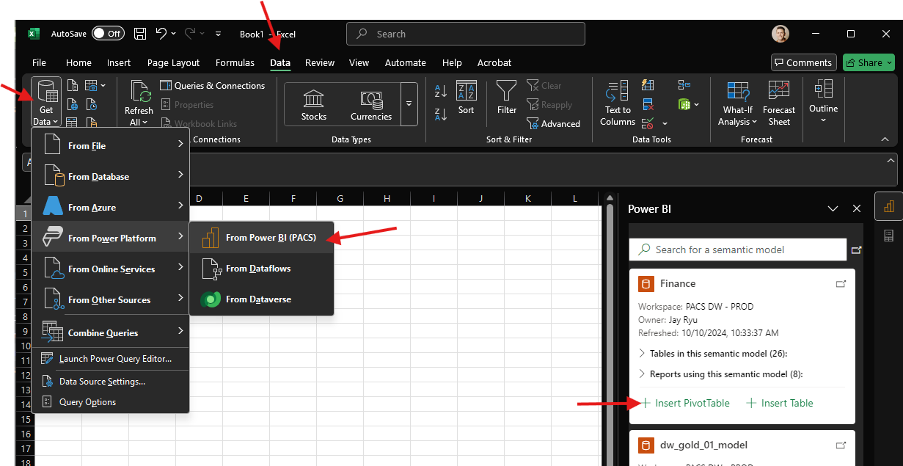

# Connect to Finance Model

1. Open Excel
2. Go to Data
3. Get Data
4. From Power Platform
5. From Power BI. 
6. Then on the right hand side you'll see all the models you can connect to. Click 'Insert PivotTable'

The pane on the right will be replaced with different fields that can be added to the
Filters, Columns, Rows, and Values. Add what you want to each field. 

When you're ready to convert to CUBE formulas, go to:

1. PivotTable Analyze
2. OLAP Tools
3. Convert to Formulas

After a few seconds you should be able to move the formulas around to build your spreadsheet out.

You'll also need to login once you connect.