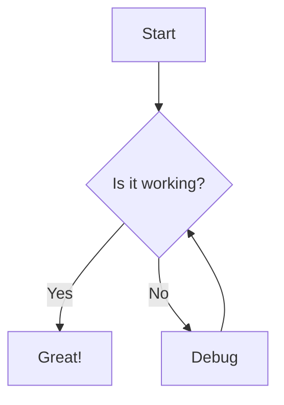

# Use Mermaid Charts

Mermaid is a JavaScript library that allows for building diagrams as code. 

Mermaid official docs: https://mermaid.js.org/intro/

## Version 1

Version 1 limits you to an older version of Mermaid.

``pip install mkdocs-mermaid2-plugin``

Update config:

```yaml
plugins:
  - search
  - mermaid2
```

Write your mermaid markdown

```markdown
# Mermaid Example



Version 1 limits you to a certain version of Mermaid. This means you can't use the 
new shapes introduced in version 11.3.0+
[https://mermaid.js.org/syntax/flowchart.html#expanded-node-shapes-in-mermaid-flowcharts-v11-3-0](https://mermaid.js.org/syntax/flowchart.html#expanded-node-shapes-in-mermaid-flowcharts-v11-3-0)

## Version 2

Version 2 gives more control but requires syntax in html tags.

Update config:

```yaml
extra_javascript:
  - https://cdn.jsdelivr.net/npm/mermaid/dist/mermaid.min.js
```

Add the import into index.md

```markdown
<script>
  mermaid.initialize({ startOnLoad: true });
</script>
```

Write your mermaid

```html
<div class="mermaid">
graph TD
    A[Start] --> B{Is it working?}
    B -- Yes --> C[Great!]
    B -- No --> D[Debug]
    D --> B
    Z@{ shape: manual-file, label: "File Handling"}
</div>
```

<div class="mermaid">
graph TD
    A[Start] --> B{Is it working?}
    B -- Yes --> C[Great!]
    B -- No --> D[Debug]
    D --> B
    C --> Z@{ shape: manual-file, label: "File Handling"}
    Z --> E@{ shape: manual-input, label: "User Input"}
    D --> F@{ shape: docs, label: "Multiple Documents"}
    G@{ shape: procs, label: "Process Automation"} -->
    H@{ shape: paper-tape, label: "Paper Records"}
</div>
