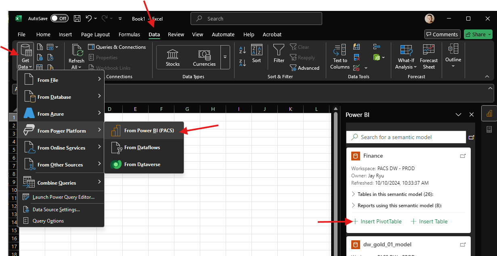

# Getting started with MKDocs

1. Create a python project.
2. Create a venv and activate it. 
    - Windows: ``venv\Scripts\activate``
    - MacOS/Linux: ``venv/bin/activate``

3. Once activated, ``pip install mkdocs``
4. Next create the project with ``mkdocs new .`` which creates a yml file.

You now have your project setup. You can create and edit markdown files 
in the ``/docs`` directory.

## Commands

``mkdocs serve`` - generate hot reloading docs to access and view

``mkdocs build`` - generate the files in a directory called ``/site``

To add configuration and navigation, edit the ``mkdocs.yml`` file. 

The only required field in this is ``site_name``.

Add nav:

```yaml
site_name: Test Docs
nav:
  - Home: index.md
  - About: about.md
```

## Deploy

If you're connected to GitHub, you can build and deploy into a separate branch
with one command ``mkdocs gh-deploy``. This will build and load the docs to a separate branch
in the repo, which can then be setup in GitHub pages to build on every push.

## Writing Docs

### Tables

You can write markdown or html tags into each page.

This header ``# Header`` is the same as ``<h1>Header</h1>``

You can do tables like this:

```markdown
| Column 1 | Column 2 | Column 3 |
|----------|----------|----------|
| Value 1  | Value 2  | Value 3  |
```

| Column 1 | Column 2 | Column 3 |
|----------|----------|----------|
| Value 1  | Value 2  | Value 3  |


or like this

```html
<table>
    <tr>
        <td>Column 1</td>
        <td>Column 2</td>
        <td>Column 3</td>
    </tr>
    <tr>
        <td>Value 1</td>
        <td>Value 2</td>
        <td>Value 3</td>
    </tr>
</table>
```

<table>
    <tr>
        <td>Column 1</td>
        <td>Column 2</td>
        <td>Column 3</td>
    </tr>
    <tr>
        <td>Value 1</td>
        <td>Value 2</td>
        <td>Value 3</td>
    </tr>
</table>

HTML is nice because you can add custom styling both inline, and through stylesheets.

In ``mkdocs.yml`` add

```yaml
extra_css:
  - css/main.css
```

Then create a directory inside of ``/docs`` you can call it anything but we'll call it ``css``. Create a stylesheet called ``main.css``.

```css
.bold-rows thead tr td {
    font-weight: bold;
    padding: 2px 10px;
}

.center-table-vals td {
    align-content: center;
    text-align: center;
}
```

Then you can use the CSS tags in the HTML elements.

```html
<table class="bold-rows center-table-vals" style="background-color: aqua">
        <thead>
            <tr>
                <td>Column 1</td>
                <td>Column 2</td>
                <td>Column 3</td>
            </tr>
        </thead>
    <tr>
        <td>Value 1</td>
        <td>Value 2</td>
        <td>Value 3</td>
    </tr>
</table>
```

<table class="bold-rows center-table-vals" style="background-color: aqua">
        <thead>
            <tr>
                <td>Column 1</td>
                <td>Column 2</td>
                <td>Column 3</td>
            </tr>
        </thead>
    <tr>
        <td>Value 1</td>
        <td>Value 2</td>
        <td>Value 3</td>
    </tr>
</table>

### Images

Add images by using this syntax ````

For example: ````

### Spacing

You can use HTML to add custom spacing in the docs:

```html
<div style="height: 20px"></div>
<hr>
```

## Generate a PDF

### Version 1

Print to PDF from web app. Does a pretty good job with formatting.

### Version 2

UNTESTED

Install the Plugin: ``pip install mkdocs-pdf-export-plugin``

Modify mkdocs.yml: Add the plugin to your MkDocs configuration file:

```yaml
plugins:
  - pdf-export
```

If you're using other plugins, ensure you list them as well.

Build the PDF: Run the following command to build the documentation and export the PDF:

``mkdocs build``

The PDF will be generated and placed in the site/pdf/ directory.


